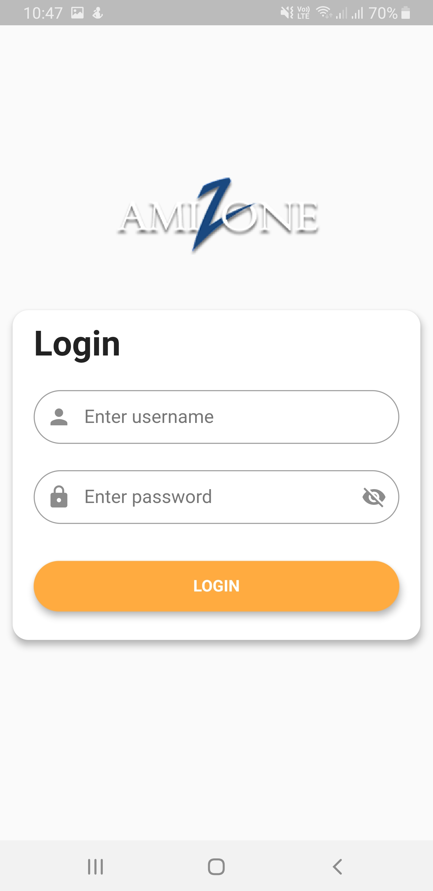
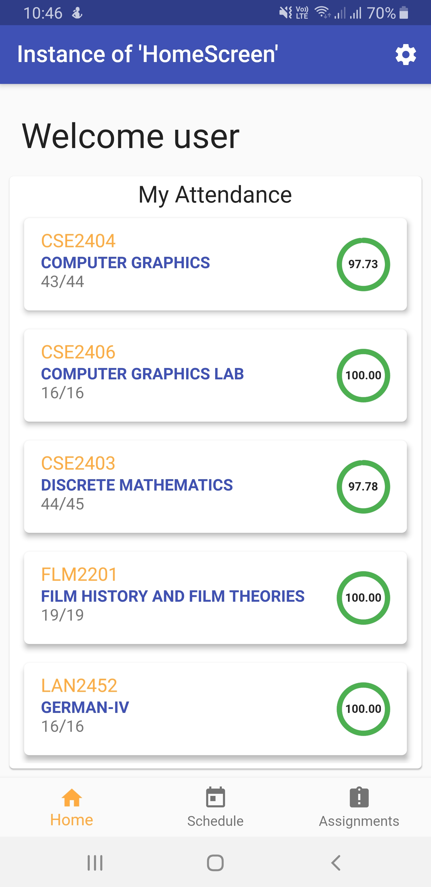
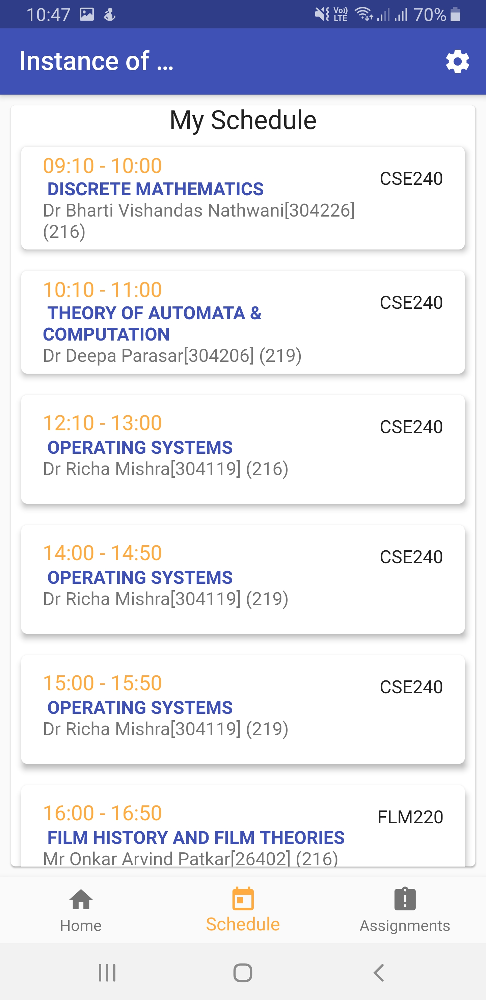

# amizone_clientapp
This is the Flutter Frontend for the APP (The backend of the project is [Here](https://github.com/NeelParihar/amizone-backend))

- Amizone is a student portal for amity student's , for that I have developed a cross platform mobile app so the Students don't have to go to the website and repeatedly login to access necessary Data .

- Developed API endpoints using flask, that will scrape the data from the amizone website and store it onto SQL database and depolyed it using Heroku. User can view Attendance , Timetable, etc. 

## Screenshots:

